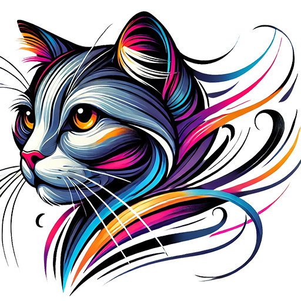
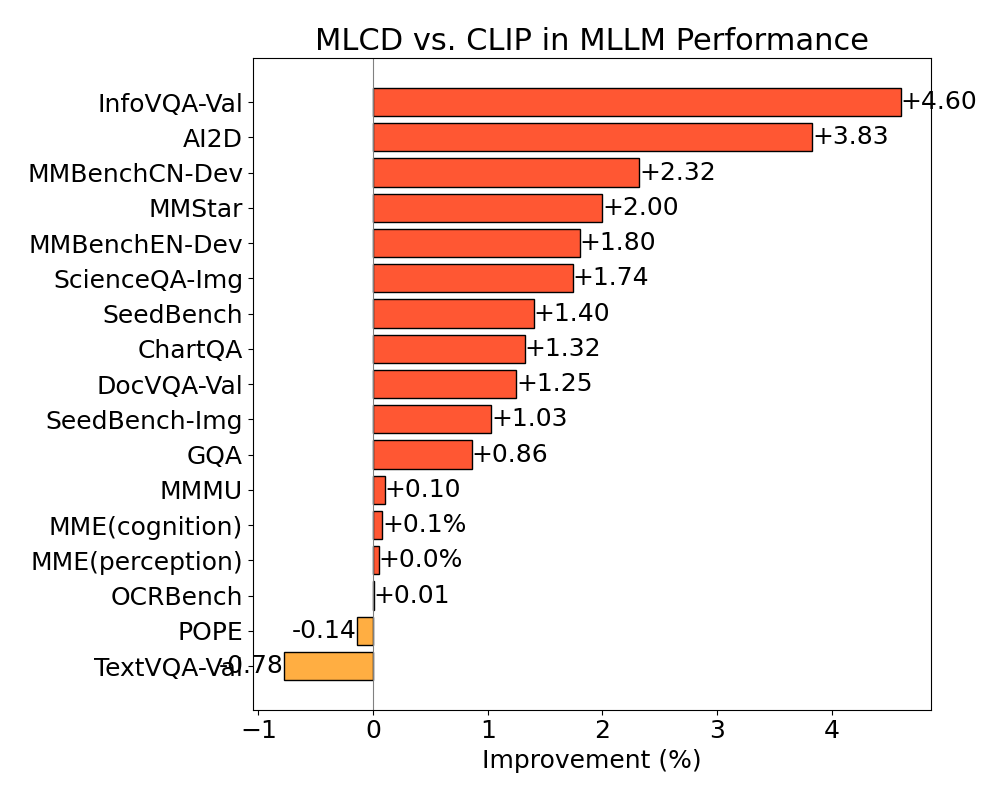

<p align="center" width="100%">

</p>
<div>


# UNICOM & MLCD
[](https://arxiv.org/abs/2407.17331) [](https://arxiv.org/abs/2304.05884) [](https://huggingface.co/collections/DeepGlint-AI/mlcd-670d18d767cea37ea7436e69)

This repository focuses on building foundational visual models for large multimodal language models using large-scale datasets such as LAION400M and COYO700M. We employ sample-to-cluster contrastive learning to optimize performance. Our models are primarily used for multimodal visual large language models, such as LLaVA.

We adopted the official [LLaVA-NeXT](https://github.com/LLaVA-VL/LLaVA-NeXT) and the official training dataset [LLaVA-NeXT-Data](https://huggingface.co/datasets/lmms-lab/LLaVA-NeXT-Data) for evaluating the foundational visual models.   
The language model is Qwen2.5-7B. 


| Vision Tower                                                                                  | RoPE2D | ChartQA   | DocVQA    | InfoVQA   | OCRBench   | MMMU      |
| :-------------------------------------------------------------------------------------------- | :----: | :-------- | :-------- | :-------- | :--------- | :-------- |
| CLIP (ViT-L-14-336px)                                                                         |   ×    | 66.52     | 75.21     | 38.88     | 525.00     | 44.20     |
| SigLIP (ViT-SO400M-384px)                                                                     |   ×    | 69.28     | 76.71     | 41.38     | 554.00     | 46.78     |
| DFN5B (ViT-H-14-378px)                                                                        |   ×    | 64.36     | 70.87     | 38.59     | 473.00     | **48.00** |
| **[HF:MLCD (ViT-L-14-336px)](https://huggingface.co/DeepGlint-AI/mlcd-vit-large-patch14-336)**   |   ×    | 67.84     | 76.46     | 43.48     | 531.00     | 44.30     |
| **[HF:MLCD (ViT-bigG-14-336px)](https://huggingface.co/DeepGlint-AI/mlcd-vit-bigG-patch14-336)** |   √    | 71.07     | 79.63     | 44.38     | 572.00     | 46.78     |
| **[HF:MLCD (ViT-bigG-14-448px)](https://huggingface.co/DeepGlint-AI/mlcd-vit-bigG-patch14-448)** |   √    | **73.80** | **83.34** | **46.59** | **582.00** | 46.00     |


The results of the ImageNet linear probe are as follows:

| Model Name             | ImageNet Linear Probe | Hugging Face                                                                               |
| :--------------------- | :-------------------: | :----------------------------------------------------------------------------------------- |
| MLCD-ViT-B-32-224px    |         79.1          | [HF:MLCD-ViT-B-32-224px](https://huggingface.co/DeepGlint-AI/mlcd-vit-base-patch32-224)    |
| MLCD-ViT-L-14-336px    |         86.3          | [HF:MLCD-ViT-L-14-336px](https://huggingface.co/DeepGlint-AI/mlcd-vit-large-patch14-336)   |
| MLCD-ViT-bigG-14-224px |         87.1          | [HF:MLCD-ViT-bigG-14-224px](https://huggingface.co/DeepGlint-AI/mlcd-vit-bigG-patch14-224) |


## Quickstart Example

Here is an example of how to use the `MLCDVisionModel` from the Transformers library for feature extraction. Please note that this requires the `transformers` library from the `master` branch. We will update this with a specific version number in the future.

```python
# pip install git+https://github.com/huggingface/transformers@v4.51.3-MLCD-preview

import requests
from PIL import Image
from transformers import AutoProcessor, MLCDVisionModel

import torch

# Load model and processor
model = MLCDVisionModel.from_pretrained("DeepGlint-AI/mlcd-vit-bigG-patch14-448")
processor = AutoProcessor.from_pretrained("DeepGlint-AI/mlcd-vit-bigG-patch14-448")

# Process single image
url = "http://images.cocodataset.org/val2017/000000039769.jpg"
image = Image.open(requests.get(url, stream=True).raw)
inputs = processor(images=image, return_tensors="pt")

# Generate outputs
with torch.no_grad():
    outputs = model(**inputs)

# Get visual features
features = outputs.last_hidden_state

print(f"Extracted features shape: {features.shape}")
```


## Latest News
<div>🤗 [2025/08] <a href="https://arxiv.org/abs/2507.20025">RICE</a> accepted as a highlight paper at ICCV 2025.</div>
<div>🤗 [2025/04] MLCD bigG has been merged into the Transformers library and can be accessed <a href="https://huggingface.co/docs/transformers/main/en/model_doc/mlcd">here</a>.</div>
<div>💖 [2025/02] We have released the <a href="https://huggingface.co/DeepGlint-AI/mlcd-vit-bigG-patch14-448">MLCD-bigG-14-448px</a> model, which has demonstrated excellent performance within the LLaVA-NeXT framework. You can reproduce these results from here <a href="https://github.com/deepglint/unicom/blob/main/mlcd_vl/scripts/pretrain_mlcd.sh">[1]</a>, <a href="https://github.com/deepglint/unicom/blob/main/mlcd_vl/scripts/finetune_mlcd.sh">[2]</a>.</div>
<div>🎅 [2024/12] We have launched the <a href="https://github.com/deepglint/unicom/tree/main/mlcd_vl/downstream">MLCD-Seg-7B</a>, achieving scores of 85.3/81.5 on RefCOCO[testA/B], 82.9/75.6 on RefCOCO+[testA/B], and 80.5 on RefCOCOg[test].</div>
<div>🤖 [2024/11] We have launched the <a href="#mlcd-embodied">MLCD-Embodied-7B</a>, which can reach the level of GPT-4V in embodied capabilities and possesses excellent general understanding abilities.</div>
<div>🤗 [2024/10] We release <a href="https://huggingface.co/DeepGlint-AI/llava-mlcd-qwen2.5-7b">MLCD-NeXT-7B</a> to Hugging Face.</div>
<div>🏰 [2024/07] <a href="#multi-label-cluster-discrimination-mlcd">MLCD</a> was accepted to ECCV2024.</div>
<div>🌍 [2023/03] <a href="#unicom">UNICOM</a> was accepted to ICLR2023.</div>

---

## MLCD-Embodied
<a name="mlcd-embodied"></a>
[](https://huggingface.co/DeepGlint-AI/MLCD-Embodied-7B)  

More details about MLCD-Embodied can be found in the [MLCD-Embodied](https://github.com/deepglint/unicom/tree/main/mlcd_vl#mlcd-embodied-7b-) file.  


### Comparison with LLaVA OneVision-7B and GPT-4

| Dataset        | Split |  MLCD-Embodied-7B   | LLaVA OneVision-7B |  GPT-4v  | GPT-4o |
| :------------- | :---: | :-----------------: | :----------------: | :------: | :----: |
| Vision Encoder |   -   | MLCD-ViT-L-14-336px |       SigLIP       |    -     |   -    |
| ChartQA        | test  |        83.0         |        80.0        |   78.5   |  85.7  |
| DocVQA         | test  |        91.6         |        87.5        |   88.4   |  92.8  |
| InfoVQA        |  val  |        73.9         |        70.7        |    -     |   -    |
| InfoVQA        | test  |        70.0         |        68.8        |    -     |   -    |
| MMMU           |  val  |        47.3         |        48.8        |   56.8   |  69.1  |
| MMStar         | test  |        58.5         |        61.7        |   57.1   |  63.9  |
| OCRBench       |   -   |        749.0        |       697.0        |  656.0   | 805.0  |
| RealWorldQA    | test  |        68.9         |        66.3        |   61.4   |  58.6  |
| SeedBench      | image |        74.9         |        75.4        |   49.9   |  76.2  |
| MME            | test  |      578/1603       |      418/1580      | 517/1409 |   -    |


## Multi-Label Cluster Discrimination (MLCD)
<a name="multi-label-cluster-discrimination-mlcd"></a>
[](https://arxiv.org/abs/2407.17331) [](https://huggingface.co/DeepGlint-AI/mlcd-vit-large-patch14-336)  


More details about MLCD can be found in the [MLCD.md](mlcd/README.md) file.


While CLIP models have shown excellence in many tasks via image-text contrastive learning, they often struggle with encoding complex semantic structures within images. To address this limitation, we introduce **Multi-Label Cluster Discrimination (MLCD)**.

MLCD improves upon traditional approaches by clustering the the LAION dataset, which contains billions of images, into one million centers and assigning multiple closest clusters as labels to each image. This technique accounts for the presence of multiple objects within a single image. We also introduce a novel multi-label classification loss, which separately handles positive and negative class losses, minimizing label ambiguity. Our experiments demonstrate that MLCD achieves state-of-the-art performance in linear probe. Moreover, MLCD shows significant potential when integrated with multimodal large language models. The following two figures compare the evaluation performance of our model on MLLM and Linear Probe. The model we used is ViT-L-14@336px.

<div style="display: flex; flex-wrap: wrap; justify-content: space-around;">
  
  
</div>


## UNICOM
<a name="unicom"></a>
[](https://arxiv.org/abs/2304.05884) [](https://drive.google.com/drive/folders/18wsNgZeNpjKAcIrWoffJ8o9UqmMHUBqN?usp=share_link)


For image representation:
1. ImageNet pretraining is not universal enough to generalize to diverse open-world objects.
2. Supervised learning is not scalable because manual annotation of large-scale training data is time-consuming, costly, and even infeasible.
3. Instance discrimination method (e.g., CLIP) can hardly encode the semantic structure of training data, because instance-wise contrastive learning always treats two samples as a negative pair, regardless of their semantic similarity.

UNICOM demonstrates superior performance in image retrieval, thanks to its ability to cluster **400000000** images into **1000000** pseudo classes using joint textual and visual features extracted by the CLIP model. Additionally, our use of a margin-based softmax loss (ArcFace) and random partial class/feature (PartialFC) selections enhances the robustness and compactness of the feature embedding. Our method outperforms state-of-the-art unsupervised and supervised image retrieval approaches, making it a powerful tool for researchers and practitioners in the field.

For detailed instructions, please refer to the UNICOM  [Documentation](unicom/README.md).


## Contributors
Thanks so much to all of our amazing contributors!

<!-- readme: collaborators,contributors -start -->
<table>
	<tbody>
		<tr>
            <td align="center">
                <a href="https://github.com/daixiangzi">
                    
                    <br />
                    <sub><b>Daixiangzi</b></sub>
                </a>
            </td>
            <td align="center">
                <a href="https://github.com/anxiangsir">
                    
                    <br />
                    <sub><b>Xiang An</b></sub>
                </a>
            </td>
            <td align="center">
                <a href="https://github.com/yiyexy">
                    
                    <br />
                    <sub><b>Yiyexy</b></sub>
                </a>
            </td>
            <td align="center">
                <a href="https://github.com/xiaranqing">
                    
                    <br />
                    <sub><b>xiaranqing</b></sub>
                </a>
            </td>
            <td align="center">
                <a href="https://github.com/SNHIPOW">
                    
                    <br />
                    <sub><b>Athinklo</b></sub>
                </a>
            </td>
            <td align="center">
                <a href="https://github.com/tanhuajie">
                    
                    <br />
                    <sub><b>Tanhuajie</b></sub>
                </a>
            </td>
		</tr>
		<tr>
            <td align="center">
                <a href="https://github.com/ZhaoYan-ai">
                    
                    <br />
                    <sub><b>ZhaoYan-ai</b></sub>
                </a>
            </td>
            <td align="center">
                <a href="https://github.com/wkzhang636">
                    
                    <br />
                    <sub><b>wkzhang636</b></sub>
                </a>
            </td>
		</tr>
	<tbody>
</table>
<!-- readme: collaborators,contributors -end -->

## Dataset Contributors
This project would not have been possible without the invaluable contributions of the following individuals, who have been instrumental in data scraping and collection:  
Thank you to all the contributors for their hard work and dedication!

| Contributor        | Emial                       |
| ------------------ | --------------------------- |
| **Bin Qin**        | skyqin@gmail.com            |
| **Lan Wu**         | bah-wl@hotmail.com          |
| **Haiqiang Jiang** | haiqiangjiang@deepglint.com |
| **Yuling Wu**      | yulingwu@deepglint.com      |

## Citation

```latex
@inproceedings{yinxie_2025_rice,
  title={Region-based Cluster Discrimination for Visual Representation Learning},
  author={Xie, Yin and Yang, Kaicheng and An, Xiang and Wu, Kun and Zhao, Yongle and Deng, Weimo and Ran, Zimin and Wang, Yumeng and Feng, Ziyong And Roy, Miles And Ismail, Elezi And Deng, Jiankang},
  booktitle={ICCV},
  year={2025}
}
@inproceedings{anxiang_2024_mlcd,
  title={Multi-label Cluster Discrimination for Visual Representation Learning},
  author={An, Xiang and Yang, Kaicheng and Dai, Xiangzi and Feng, Ziyong and Deng, Jiankang},
  booktitle={ECCV},
  year={2024}
}
@inproceedings{anxiang_2023_unicom,
  title={Unicom: Universal and Compact Representation Learning for Image Retrieval},
  author={An, Xiang and Deng, Jiankang and Yang, Kaicheng and Li, Jiawei and Feng, Ziyong and Guo, Jia and Yang, Jing and Liu, Tongliang},
  booktitle={ICLR},
  year={2023}
}
@inproceedings{anxiang_2022_partialfc,
    author={An, Xiang and Deng, Jiankang and Guo, Jia and Feng, Ziyong and Zhu, XuHan and Yang, Jing and Liu, Tongliang},
    title={Killing Two Birds With One Stone: Efficient and Robust Training of Face Recognition CNNs by Partial FC},
    booktitle={CVPR},
    year={2022},
}
@inproceedings{deng_2019_arcface,
  title={Arcface: Additive angular margin loss for deep face recognition},
  author={Deng, Jiankang and Guo, Jia and Xue, Niannan and Zafeiriou, Stefanos},
  booktitle={CVPR},
  year={2019}
}
```

## Acknowledgement  

We extend our deepest gratitude to the creators and contributors of the following projects:  
1. [llava-next](https://github.com/LLaVA-VL/LLaVA-NeXT): The comprehensive codebase for training Vision-Language Models (VLMs).  
2. [lmms-eval](https://github.com/EvolvingLMMs-Lab/lmms-eval): The robust tool for evaluating Vision-Language Models (VLMs).
3. [OpenEQA](https://github.com/facebookresearch/open-eqa): A wonderful benchmark for Embodied Question Answering.
4. [RoboVQA](https://github.com/google-deepmind/robovqa): Provide high level reasoning model and dataset for robotics.

Their exceptional work has been instrumental to our research and development efforts.


