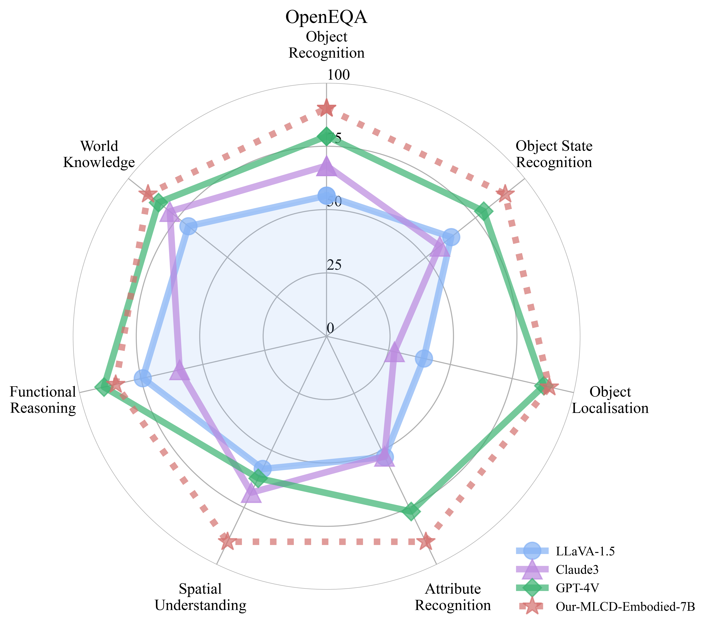
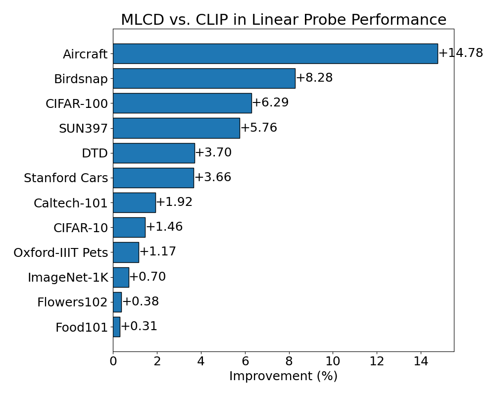

<p align="center" width="100%">

</p>
<div>


# UNICOM & MLCD
[](https://arxiv.org/abs/2407.17331) [](https://arxiv.org/abs/2304.05884) [](https://huggingface.co/collections/DeepGlint-AI/mlcd-670d18d767cea37ea7436e69)

This repository is dedicated to building foundational visual models using large-scale datasets such as LAION400M and COYO700M. We employ sample-to-cluster contrastive learning to optimize performance. Our models have been thoroughly validated across various tasks, including multimodal visual large language models (e.g., LLaVA), image retrieval, and image classification.


# Latest News
🤖 [2024/11] We have launched the [MLCD-Embodied-7B](#mlcd-embodied), which can reach the level of GPT-4V in embodied capabilities and possesses excellent general understanding abilities. For more details, please click &rarr; [MLCD-Embodied.md](docs/MLCD_Embodied.md).  
🤗 [2024/10] We release [MLCD-NeXT-7B](https://huggingface.co/DeepGlint-AI/llava-mlcd-qwen2.5-7b) to Hugging Face.  
🤌 [2024/07] [MLCD](#multi-label-cluster-discrimination-mlcd) was accepted to ECCV2024.  
🌍 [2023/03] [UNICOM](#unicom) was accepted to ICLR2023.  

---

## MLCD-Embodied
<a name="mlcd-embodied"></a>
[](https://huggingface.co/DeepGlint-AI/MLCD-Embodied-7B)  
More details about MLCD-Embodied can be found in the [MLCD-Embodied.md](docs/MLCD_Embodied.md) file.  

Some test results are as follows:
<div style="display: flex; flex-wrap: wrap; justify-content: space-around;">
  
  
</div>


#### General Ability Evaluation: Comparison with LLaVA OneVision-7B and GPT-4

| Dataset     | Split   | MLCD-Embodied-7B | LLaVA OneVision-7B | GPT-4v   | GPT-4o |
| :--         | :-:    | :-: | :-: | :-: | :-: |
| Vision Encoder| - | MLCD-ViT-L-14-336px | SigLIP  |-|-|
| A12D        | test    | 79.9             | 81.4               | 78.2     | 94.2   |
| ChartQA     | test    | 83.0             | 80.0               | 78.5     | 85.7   |
| DocVQA      | test    | 91.6             | 87.5               | 88.4     | 92.8   |
| InfoVQA     | val     | 73.9             | 70.7               | -        | -      |
| InfoVQA     | test    | 70.0             | 68.8               | -        | -      |
| MMMU        | val     | 47.3             | 48.8               | 56.8     | 69.1   |
| MMStar      | test    | 58.5             | 61.7               | 57.1     | 63.9   |
| OCRBench    | -       | 749.0            | 697.0              | 656.0    | 805.0  |
| RealWorldQA | test    | 68.9             | 66.3               | 61.4     | 58.6   |
| SeedBench   | image   | 74.9             | 75.4               | 49.9     | 76.2   |
| MMbench     | en-dev  | 81.1             | 83.2               | 81.3     | 83.4   |
| MMbench     | en-test | 80.1             | 80.8               | 75.0     | -      |
| MME         | test    | 578/1603         | 418/1580           | 517/1409 | -      |


## Multi-Label Cluster Discrimination (MLCD)
<a name="multi-label-cluster-discrimination-mlcd"></a>
[](https://arxiv.org/abs/2407.17331) [](https://huggingface.co/DeepGlint-AI/mlcd-vit-large-patch14-336)

More details about MLCD can be found in the [MLCD.md](docs/MLCD.md) file.


While CLIP models have shown excellence in many tasks via image-text contrastive learning, they often struggle with encoding complex semantic structures within images. To address this limitation, we introduce **Multi-Label Cluster Discrimination (MLCD)**.


MLCD improves upon traditional approaches by clustering the the LAION dataset, which contains billions of images, into one million centers and assigning multiple closest clusters as labels to each image. This technique accounts for the presence of multiple objects within a single image. We also introduce a novel multi-label classification loss, which separately handles positive and negative class losses, minimizing label ambiguity. Our experiments demonstrate that MLCD achieves state-of-the-art performance in linear probe. Moreover, MLCD shows significant potential when integrated with multimodal large language models. The following two figures compare the evaluation performance of our model on MLLM and Linear Probe. The model we used is ViT-L-14@336px.

<div style="display: flex; flex-wrap: wrap; justify-content: space-around;">
  
  
</div>


####  MLLMs Evaluation Results

<p align="center" width="100%">


To evaluate MLCD’s performance within multimodal large language models (MLLMs), we replaced the CLIP model in LLaVA-NeXT with the MLCD model. We paired this with the Qwen2.5-7B language model. For reproducibility, we utilized the LLaVA-Pretrain dataset for pre-training and the LLaVA-NeXT-Data for structured fine-tuning. The evaluation results confirm that the MLCD model performs exceptionally well across multiple benchmarks, underscoring its effectiveness in MLLMs. 


| Vision Tower    | MLCD (ViT_L_14_336px) | CLIP (ViT_L_14_336px) |
|:----------------|:-------------|:-------------|
| LLM             | Qwen2.5-7B   |   Qwen2.5-7B |
| AI2D            | **76.98**    | 73.15        |
| GQA             | **64.17**    | 63.31        |
| ScienceQA-Img   | **78.09**    | 76.35        |
| InfoVQA-Val     | **43.48**    | 38.88        |
| MMBenchCN-Dev  | **74.83**    | 72.51        |
| MMBenchEN-Dev  | **76.37**    | 74.57        |
| SeedBench       | **68.20**    | 66.80        |
| SeedBench-Img   | **73.75**    | 72.72        |
| MMStar          | **50.98**    | 48.98        |
| MMMU            | **44.30**    | 44.20        |
| POPE            | 88.69        | **88.83**    |
| ChartQA         | **67.84**    | 66.52        |
| DocVQA-Val      | **76.46**    | 75.21        |
| TextVQA-Val     | 61.69        | **62.47**    |
| OCRBench        | **531**      | 525       |
| MME (cognition)  | **432**      | 384          |
| MME (perception) | **1598**     | 1512         |


### Usage
#### A. Installation

##### **Clone this repository and navigate to the LLaVA folder:**
```bash
git clone https://github.com/deepglint/unicom
cd unicom

# Upgrade pip and install necessary dependencies
pip config set global.index-url https://pypi.org/simple
pip install --upgrade pip
pip install -e ".[train]"

# flash attention
pip install flash-attn --no-build-isolation
```

#### B. Training

**Stage 1: Pretraining**
```bash
bash scripts/pretrain_mlcd.sh
```

**Stage 2: Instructional Finetuning**
```bash
bash scripts/finetune_mlcd.sh
```


#### C. Evaluation  
Install the evaluation tool and execute the evaluation script:
```bash
pip install lmms-eval==0.2.0
bash eval.sh
```
---

## UNICOM
<a name="unicom"></a>
[](https://arxiv.org/abs/2304.05884) [](https://drive.google.com/drive/folders/18wsNgZeNpjKAcIrWoffJ8o9UqmMHUBqN?usp=share_link)


For image representation:
1. ImageNet pretraining is not universal enough to generalize to diverse open-world objects.
2. Supervised learning is not scalable because manual annotation of large-scale training data is time-consuming, costly, and even infeasible.
3. Instance discrimination method (e.g., CLIP) can hardly encode the semantic structure of training data, because instance-wise contrastive learning always treats two samples as a negative pair, regardless of their semantic similarity.

UNICOM demonstrates superior performance in image retrieval, thanks to its ability to cluster **400000000** images into **1000000** pseudo classes using joint textual and visual features extracted by the CLIP model. Additionally, our use of a margin-based softmax loss (ArcFace) and random partial class/feature (PartialFC) selections enhances the robustness and compactness of the feature embedding. Our method outperforms state-of-the-art unsupervised and supervised image retrieval approaches, making it a powerful tool for researchers and practitioners in the field.

### Usage

For detailed instructions, please refer to the UNICOM  [Documentation](unicom/README.md).


## Contributors
Thanks so much to all of our amazing contributors!

<a href="https://github.com/deepglint/unicom/graphs/contributors">
  "/>
</a>


## Dataset Contributors
This project would not have been possible without the invaluable contributions of the following individuals, who have been instrumental in data scraping and collection:  
Thank you to all the contributors for their hard work and dedication!

| Contributor      | Emial    |
|------------------|----------|
| **Bin Qin**         | skyqin@gmail.com              |
| **Lan Wu**          | bah-wl@hotmail.com            |
| **Haiqiang Jiang**  | haiqiangjiang@deepglint.com   |
| **Yuling Wu**       | yulingwu@deepglint.com        |

## Citation

```latex
@inproceedings{anxiang_2024_mlcd,
  title={Multi-label Cluster Discrimination for Visual Representation Learning},
  author={An, Xiang and Yang, Kaicheng and Dai, Xiangzi and Feng, Ziyong and Deng, Jiankang},
  booktitle={ECCV},
  year={2024}
}
@inproceedings{anxiang_2023_unicom,
  title={Unicom: Universal and Compact Representation Learning for Image Retrieval},
  author={An, Xiang and Deng, Jiankang and Yang, Kaicheng and Li, Jiawei and Feng, Ziyong and Guo, Jia and Yang, Jing and Liu, Tongliang},
  booktitle={ICLR},
  year={2023}
}
@inproceedings{anxiang_2022_partialfc,
    author={An, Xiang and Deng, Jiankang and Guo, Jia and Feng, Ziyong and Zhu, XuHan and Yang, Jing and Liu, Tongliang},
    title={Killing Two Birds With One Stone: Efficient and Robust Training of Face Recognition CNNs by Partial FC},
    booktitle={CVPR},
    year={2022},
}
@inproceedings{deng_2019_arcface,
  title={Arcface: Additive angular margin loss for deep face recognition},
  author={Deng, Jiankang and Guo, Jia and Xue, Niannan and Zafeiriou, Stefanos},
  booktitle={CVPR},
  year={2019}
}
```

## Acknowledgement  

We extend our deepest gratitude to the creators and contributors of the following projects:  
1. [llava-next](https://github.com/LLaVA-VL/LLaVA-NeXT): The comprehensive codebase for training Vision-Language Models (VLMs).  
2. [lmms-eval](https://github.com/EvolvingLMMs-Lab/lmms-eval): The robust tool for evaluating Vision-Language Models (VLMs).
3. [OpenEQA](https://github.com/facebookresearch/open-eqa): A wonderful benchmark for Embodied Question Answering.
4. [RoboVQA](https://github.com/google-deepmind/robovqa): Provide high level reasoning model and dataset for robotics.

Their exceptional work has been instrumental to our research and development efforts.


