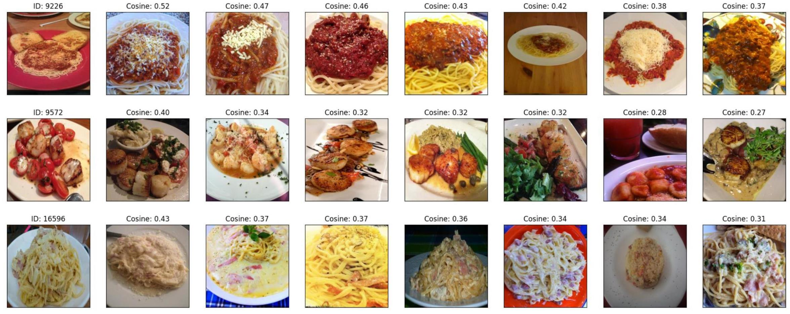
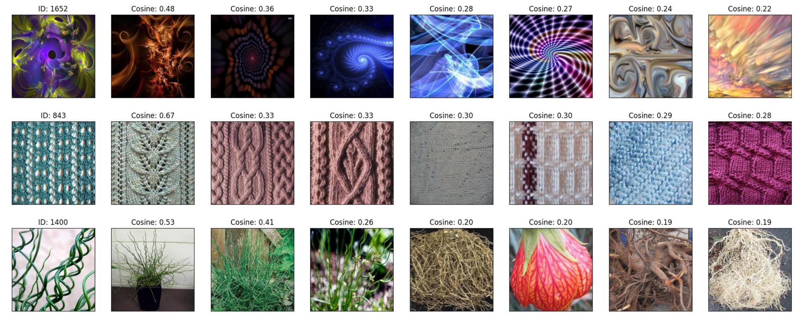

### code

```python
import unicom
import torch

from torch.utils.data import DataLoader
from torchvision.datasets import DTD
from tqdm import tqdm
from torch.nn.functional import normalize
import matplotlib.pyplot as plt

torch.manual_seed(2048)
model, preprocess = unicom.load("ViT-L/14@336px")
model = model.cuda()
testset = DTD("~/.cache", download=True, split="test", transform=preprocess)
testset_wo_transform = DTD("~/.cache", download=True, split="test", transform=None)

@torch.no_grad()
def get_features(dataset):
    all_features = []
    for images, _ in tqdm(DataLoader(dataset, batch_size=32, num_workers=8)):
        features = model(images.cuda())
        all_features.append(features)
    return torch.cat(all_features)

test_embedding = get_features(testset)
print(test_embedding.shape)
test_embedding = normalize(test_embedding)

random_row = torch.randint(0, test_embedding.size(0), (5, ))[:5]
cosine = test_embedding[random_row] @ test_embedding.T
score, index = torch.sort(cosine, descending=True)

original_images = []
plt.figure(figsize=(24, 16))

for row in range(5):
    for col in range(8):
        idx = index[row][col]
        if col == 0:
            title = f"ID: {idx}"
        else:
            title = f"Cosine: {score[row][col] :.2f}"

        image = testset_wo_transform[idx][0].convert("RGB")
        plt.subplot(5, 8, row * 8 + col + 1, fc='b')
        plt.imshow(image.resize((300, 300)))
        plt.title(title)
        plt.xticks([])
        plt.yticks([])

plt.savefig("vis.jpg")

```

### result 

#### 1. **Food-101**

#### 2. **Describable Textures Dataset**

