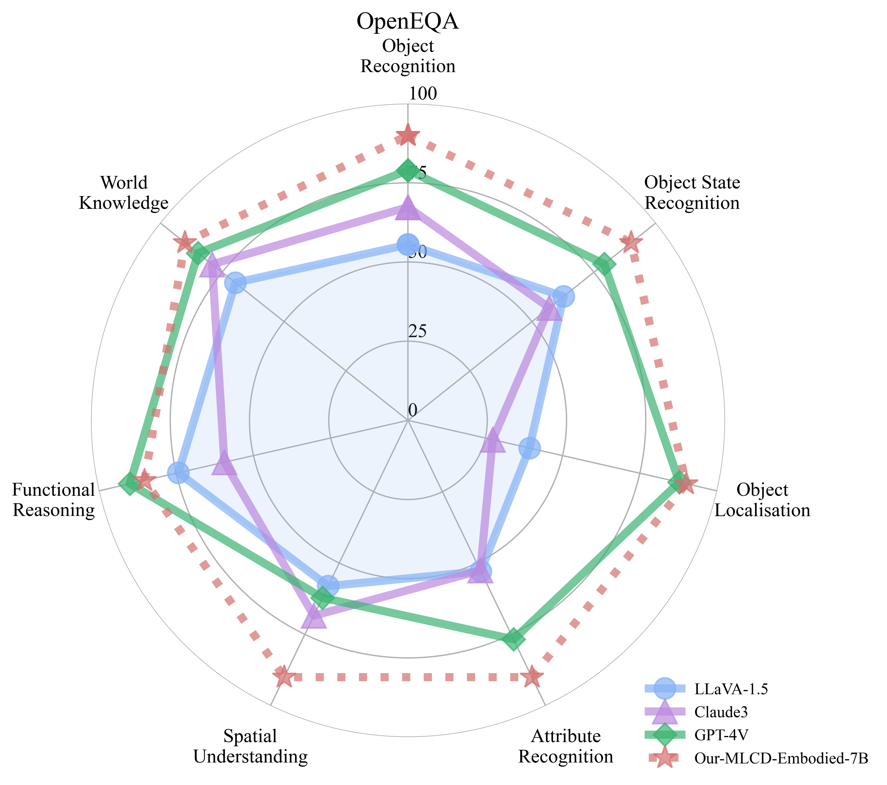

# MLCD-Embodied 🤖

<a name="mlcd-embodied"></a>
[](https://huggingface.co/DeepGlint-AI/MLCD-Embodied-7B)  

MLCD-Embodied is comparable to 4v in terms of embodied capabilities and possesses excellent general capabilities. The detailed evaluation results are shown below.


<div style="display: flex; flex-wrap: wrap; justify-content: space-around;">
  
  
</div>

## Embodied Ability Evaluation: Performance in RoboVQA and OpenEQA

<div style="overflow-x: auto;">
  <table style="white-space: nowrap;">
    <tr>
      <th></th>
      <th></th>
      <th>MLCD-Embodied-7B</th>
      <th>LLaVA OneVision-7B</th>
      <th>GPT-4V</th>
      <th>RoboMamba</th>
    </tr>
    <tr>
      <td><strong>RoboVQA</strong></td>
      <td>BLEU1</td>
      <td><strong>73.16</strong></td>
      <td>38.12</td>
      <td>-</td>
      <td>54.9</td>
    </tr>
    <tr>
      <td></td>
      <td>BLEU2</td>
      <td><strong>66.39</strong></td>
      <td>33.56</td>
      <td>-</td>
      <td>44.2</td>
    </tr>
    <tr>
      <td></td>
      <td>BLEU3</td>
      <td><strong>60.61</strong></td>
      <td>31.76</td>
      <td>-</td>
      <td>39.5</td>
    </tr>
    <tr>
      <td></td>
      <td>BLEU4</td>
      <td><strong>56.56</strong></td>
      <td>30.97</td>
      <td>-</td>
      <td>36.3</td>
    </tr>
    <tr>
      <td><strong>OpenEQA</strong></td>
      <td>OBJECT-STATE-RECOGNITION</td>
      <td><strong>71.83</strong></td>
      <td>-</td>
      <td>63.2</td>
      <td>-</td>
    </tr>
    <tr>
      <td></td>
      <td>OBJECT-RECOGNITION</td>
      <td><strong>49.46</strong></td>
      <td>-</td>
      <td>43.4</td>
      <td>-</td>
    </tr>
    <tr>
      <td></td>
      <td>FUNCTIONAL-REASONING</td>
      <td>54.38</td>
      <td>-</td>
      <td><strong>57.4</strong></td>
      <td>-</td>
    </tr>
    <tr>
      <td></td>
      <td>SPATIAL-UNDERSTANDING</td>
      <td><strong>48.64</strong></td>
      <td>-</td>
      <td>33.6</td>
      <td>-</td>
    </tr>
    <tr>
      <td></td>
      <td>ATTRIBUTE-RECOGNITION</td>
      <td><strong>67.08</strong></td>
      <td>-</td>
      <td>57.2</td>
      <td>-</td>
    </tr>
    <tr>
      <td></td>
      <td>WORLD-KNOWLEDGE</td>
      <td><strong>53.87</strong></td>
      <td>-</td>
      <td>50.7</td>
      <td>-</td>
    </tr>
    <tr>
      <td></td>
      <td>OBJECT-LOCALIZATION</td>
      <td><strong>43.06</strong></td>
      <td>-</td>
      <td>42.0</td>
      <td>-</td>
    </tr>
  </table>
</div>


## General Ability Evaluation: Comparison with LLaVA OneVision-7B and GPT-4

<div style="overflow-x: auto;">
  <table style="white-space: nowrap;">
    <tr>
      <th>Dataset</th>
      <th>Split</th>
      <th>MLCD-Embodied-7B</th>
      <th>LLaVA OneVision-7B</th>
      <th>GPT-4v</th>
      <th>GPT-4o</th>
    </tr>
    <tr>
      <td>A12D</td>
      <td>test</td>
      <td>79.9</td>
      <td>81.4</td>
      <td>78.2</td>
      <td>94.2</td>
    </tr>
    <tr>
      <td>ChartQA</td>
      <td>test</td>
      <td>83.0</td>
      <td>80.0</td>
      <td>78.5</td>
      <td>85.7</td>
    </tr>
    <tr>
      <td>DocVQA</td>
      <td>test</td>
      <td>91.6</td>
      <td>87.5</td>
      <td>88.4</td>
      <td>92.8</td>
    </tr>
    <tr>
      <td>InfoVQA</td>
      <td>val</td>
      <td>73.9</td>
      <td>70.7</td>
      <td>-</td>
      <td>-</td>
    </tr>
    <tr>
      <td>InfoVQA</td>
      <td>test</td>
      <td>70.0</td>
      <td>68.8</td>
      <td>-</td>
      <td>-</td>
    </tr>
    <tr>
      <td>MMMU</td>
      <td>val</td>
      <td>47.3</td>
      <td>48.8</td>
      <td>56.8</td>
      <td>69.1</td>
    </tr>
    <tr>
      <td>MMStar</td>
      <td>test</td>
      <td>58.5</td>
      <td>61.7</td>
      <td>57.1</td>
      <td>63.9</td>
    </tr>
    <tr>
      <td>OCRBench</td>
      <td>-</td>
      <td>749.0</td>
      <td>697.0</td>
      <td>656.0</td>
      <td>805.0</td>
    </tr>
    <tr>
      <td>RealWorldQA</td>
      <td>test</td>
      <td>68.9</td>
      <td>66.3</td>
      <td>61.4</td>
      <td>58.6</td>
    </tr>
    <tr>
      <td>SeedBench</td>
      <td>image</td>
      <td>74.9</td>
      <td>75.4</td>
      <td>49.9</td>
      <td>76.2</td>
    </tr>
    <tr>
      <td>MMbench</td>
      <td>en-dev</td>
      <td>81.1</td>
      <td>83.2</td>
      <td>81.3</td>
      <td>83.4</td>
    </tr>
    <tr>
      <td>MMbench</td>
      <td>en-test</td>
      <td>80.1</td>
      <td>80.8</td>
      <td>75.0</td>
      <td>-</td>
    </tr>
    <tr>
      <td>MME</td>
      <td>test</td>
      <td>578/1603</td>
      <td>418/1580</td>
      <td>517/1409</td>
      <td>-</td>
    </tr>
  </table>
</div>

## Usage

### A. Installation

```bash
git clone https://github.com/deepglint/unicom
cd unicom

# Upgrade pip and install necessary dependencies
pip install --upgrade pip
pip install -e ".[train]"
```

### B. Inference

```bash
CUDA_VISIBLE_DEVICES=0 python infer.py --model_dir /path/to/your/model

# example:
# >> Enter 'exit' to end the conversation, 'reset' to clear the chat history.
# >> Enter image file paths (comma-separated): ./_static/images/logo.png
# >> User: <image>What kind of animal is it in this picture?
# >> Assistant: The image features a stylized representation of a cat, characterized by its vibrant and abstract depiction.
# >> User: What color is this cat?
# >> Assistant: The cat in the image is primarily white with blue, orange and pink accents, creating a visually appealing and unique appearance.
```

### C. Evaluation for Embodied Ability

#### Step 1

Download raw data following [OpenEQA](https://github.com/facebookresearch/open-eqa/tree/main/data) and [RoboVQA](https://console.cloud.google.com/storage/browser/gdm-robovqa)(val part)

#### Step 2

Converting raw data into the format required for model evaluation.
```bash
# convert OpenEQA benchmark. Note: replace the paths with your own.
python llava/benchmark/make_openeqa_bmk.py

# convert RoboVQA benchmark. Note: replace the paths with your own.
python llava/benchmark/make_robovqa_bmk.py
```

#### Step 3

Make sure that your top-level directory structure should look like this:
```
|--/path/to/your/benchmarks
|  |--OpenEQA
|  |  |--openeqa_scannet.parquet
|  |  |--openeqa_hm3d.parquet
|  |--RoboVQA
|     |--robovqa.parquet
|--/path/to/your/images
   |--openeqa_val
   |  |--scannet-v0
   |  |  |--002-scannet-scene0709_00
   |  |  |--xxx-scannet-scenexxxx_xx
   |  |--hm3d-v0
   |     |--000-hm3d-BFRyYbPCCPE
   |     |--xxx-hm3d-xxxxxxxxxxx
   |--robovqa_val
      |--robovqa_221911
      |--robovqa_xxxxxx
```

#### Step 4

Run script for evaluation 
```bash
# Note: replace 'YOUR_API_KEY', 'YOUR_ENDPOINT', 'bmk_root', 'image_folder' with your own.
bash scripts/eval/eval_robo.sh /path/to/your/model
```

### D. Evaluation for General Ability

Install the evaluation tool and execute the evaluation script:
```bash
pip install lmms-eval==0.2.0
PYTHONPATH=./ CUDA_VISIBLE_DEVICES=0,1,2,3,4,5,6,7 python -m accelerate.commands.launch \
    --main_process_port=12444 \
    --num_processes=8 \
    -m lmms_eval \
    --model llava \
    --model_args pretrained=DeepGlint-AI/MLCD-Embodied-7B,conv_template=qwen_1_5 \
    --tasks mme \
    --batch_size 1 \
    --log_samples \
    --log_samples_suffix mlcd \
    --output_path ./eval_log/
```