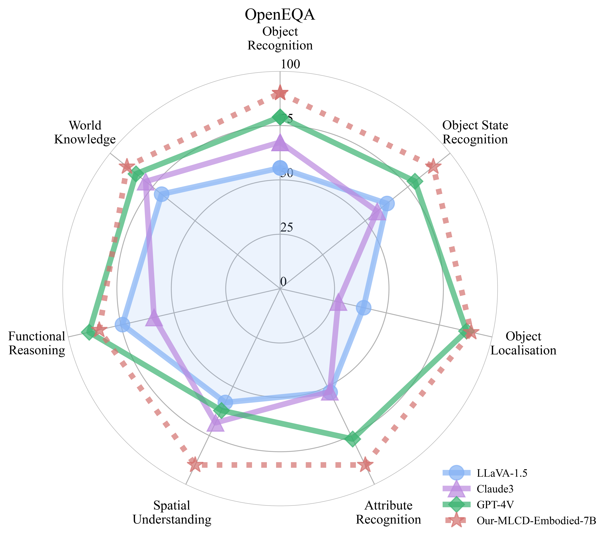
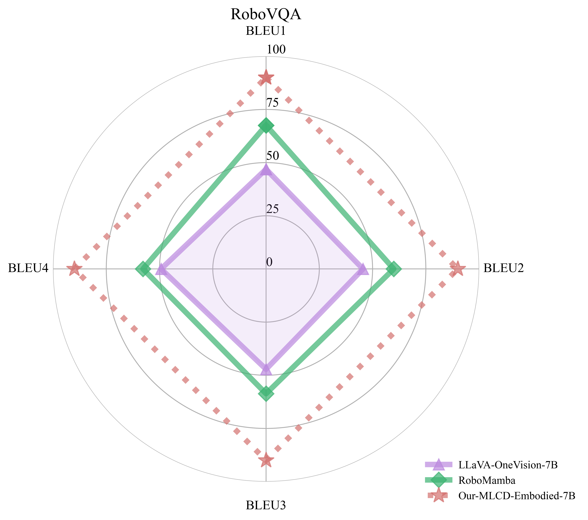

# MLCD-LLaVA-NeXT: A Multimodal Model with Enhanced Vision Capabilities

## Overview

MLCD-LLaVA-NeXT is our implementation that integrates the powerful MLCD vision encoder with the LLaVA-NeXT architecture. Our model leverages [Qwen2.5-7B](https://huggingface.co/Qwen/Qwen2.5-7B) as the language model and introduces several variants of the MLCD vision tower to achieve superior performance across multiple vision-language benchmarks.

We built upon the [official LLaVA-NeXT framework](https://github.com/LLaVA-VL/LLaVA-NeXT) and trained using the [LLaVA-NeXT-Data](https://huggingface.co/datasets/lmms-lab/LLaVA-NeXT-Data) dataset to ensure a fair comparison with other vision-language models.

## Performance Comparison

Our MLCD vision encoders demonstrate significant improvements across various vision-language benchmarks when compared to other vision encoders:

| Vision Tower | RoPE2D | ChartQA | DocVQA | InfoVQA | OCRBench | MMMU |
|:------------|:------:|:--------|:--------|:--------|:---------|:------|
| CLIP (ViT-L-14-336px) | × | 66.52 | 75.21 | 38.88 | 525.00 | 44.20 |
| SigLIP (ViT-SO400M-384px) | × | 69.28 | 76.71 | 41.38 | 554.00 | 46.78 |
| DFN5B (ViT-H-14-378px) | × | 64.36 | 70.87 | 38.59 | 473.00 | **48.00** |
| **[MLCD (ViT-L-14-336px)](https://huggingface.co/DeepGlint-AI/mlcd-vit-large-patch14-336)** | × | 67.84 | 76.46 | 43.48 | 531.00 | 44.30 |
| **[MLCD (ViT-bigG-14-336px)](https://huggingface.co/DeepGlint-AI/mlcd-vit-bigG-patch14-336)** | ✓ | 71.07 | 79.63 | 44.38 | 572.00 | 46.78 |
| **[MLCD (ViT-bigG-14-448px)](https://huggingface.co/DeepGlint-AI/mlcd-vit-bigG-patch14-448)** | ✓ | **73.80** | **83.34** | **46.59** | **582.00** | 46.00 |

*Note: Bold values indicate the best performance for each benchmark.*

### Key Highlights

- **Best Performance**: MLCD (ViT-bigG-14-448px) achieves state-of-the-art results on 4 out of 5 benchmarks
- **RoPE2D Integration**: Our larger models utilize Rotary Position Embedding in 2D (RoPE2D) for improved spatial understanding

## Getting Started


### Prerequisites

- NVIDIA GPUs with at least 80GB VRAM (recommended: A100 or H100)


### Installation
We provide a Docker environment to ensure reproducibility and ease of use:


Clone this repository and navigate to the LLaVA folder: 

```bash
git clone https://github.com/deepglint/unicom
cd unicom/mlcd_vl/

docker build -t train_mlcd_llava .


# Start container
docker run --gpus all \
-v $(pwd):/workspace \
--rm \
-w /workspace \
--shm-size=64g -it train_mlcd_llava bash
```

### Training

**Stage 1: MLCD-LLaVA-NeXT Pretraining**
```bash
bash scripts/pretrain_mlcd.sh
```

**Stage 2: MLCD-LLaVA-NeXT Instructional Finetuning**
```bash
bash scripts/finetune_mlcd.sh
```


### Evaluation  
We evaluate MLCD-LLaVA-NeXT using the `lmms-eval` framework to ensure fair and comprehensive performance assessment:

```bash
pip install lmms-eval==0.2.0
bash eval.sh
```
---

### Model Variants

All MLCD vision tower variants are available on the Hugging Face Hub:

- [MLCD (ViT-L-14-336px)](https://huggingface.co/DeepGlint-AI/mlcd-vit-large-patch14-336): Our base model with 336px resolution
- [MLCD (ViT-bigG-14-336px)](https://huggingface.co/DeepGlint-AI/mlcd-vit-bigG-patch14-336): Enhanced architecture with RoPE2D at 336px
- [MLCD (ViT-bigG-14-448px)](https://huggingface.co/DeepGlint-AI/mlcd-vit-bigG-patch14-448): Our flagship model with 448px resolution


### Citing MLCD
```latex
@inproceedings{anxiang_2024_mlcd,
  title={Multi-label Cluster Discrimination for Visual Representation Learning},
  author={An, Xiang and Yang, Kaicheng and Dai, Xiangzi and Feng, Ziyong and Deng, Jiankang},
  booktitle={ECCV},
  year={2024}
}
```


## MLCD-Embodied-7B 🤖

<a name="mlcd-embodied"></a>
[](https://huggingface.co/DeepGlint-AI/MLCD-Embodied-7B)  

MLCD-Embodied is comparable to 4v in terms of embodied capabilities and possesses excellent general capabilities. The detailed evaluation results are shown below.


<div style="display: flex; flex-wrap: wrap; justify-content: space-around;">
  
  
</div>

## Embodied Ability Evaluation: Performance in RoboVQA and OpenEQA


|                |                   | MLCD-Embodied-7B | LLaVA OneVision-7B | GPT-4V | RoboMamba |
|----------------|-------------------|-------------------|--------------------|--------|-----------|
| **RoboVQA**   | BLEU1             | **73.16**        | 38.12             | -      | 54.9      |
|                | BLEU2             | **66.39**        | 33.56             | -      | 44.2      |
|                | BLEU3             | **60.61**        | 31.76             | -      | 39.5      |
|                | BLEU4             | **56.56**        | 30.97             | -      | 36.3      |
| **OpenEQA**    | OBJECT-STATE-RECOGNITION | **71.83** | -           | 63.2   | -         |
|                | OBJECT-RECOGNITION        | **49.46** | -           | 43.4   | -         |
|                | FUNCTIONAL-REASONING      | 54.38 | -           | **57.4** | -       |
|                | SPATIAL-UNDERSTANDING     | **48.64** | -           | 33.6   | -         |
|                | ATTRIBUTE-RECOGNITION     | **67.08** | -           | 57.2   | -         |
|                | WORLD-KNOWLEDGE           | **53.87** | -           | 50.7   | -         |
|                | OBJECT-LOCALIZATION       | **43.06** | -           | 42.0     | -         |


## General Ability Evaluation: Comparison with LLaVA OneVision-7B and GPT-4


| Dataset     | Split   | MLCD-Embodied-7B | LLaVA OneVision-7B | GPT-4v   | GPT-4o |
| :-- | :-: | :-: | :-: | :-: | :-: |
| A12D        | test    | 79.9             | 81.4               | 78.2     | 94.2   |
| ChartQA     | test    | 83.0             | 80.0               | 78.5     | 85.7   |
| DocVQA      | test    | 91.6             | 87.5               | 88.4     | 92.8   |
| InfoVQA     | val     | 73.9             | 70.7               | -        | -      |
| InfoVQA     | test    | 70.0             | 68.8               | -        | -      |
| MMMU        | val     | 47.3             | 48.8               | 56.8     | 69.1   |
| MMStar      | test    | 58.5             | 61.7               | 57.1     | 63.9   |
| OCRBench    | -       | 749.0            | 697.0              | 656.0    | 805.0  |
| RealWorldQA | test    | 68.9             | 66.3               | 61.4     | 58.6   |
| SeedBench   | image   | 74.9             | 75.4               | 49.9     | 76.2   |
| MMbench     | en-dev  | 81.1             | 83.2               | 81.3     | 83.4   |
| MMbench     | en-test | 80.1             | 80.8               | 75.0     | -      |
| MME         | test    | 578/1603         | 418/1580           | 517/1409 | -      |


## Usage

### A. Installation

```bash
docker build -t train_mlcd_llava .

docker run --gpus all \
-v /vlm:/vlm \
-v /mnt:/mnt \
-v /mnt/data/huggingface/:/root/.cache/huggingface \
-v $(pwd):/workspace \
--rm \
-w /workspace \
--shm-size=64g -it train_mlcd_llava bash
```

### B. Inference

```bash
CUDA_VISIBLE_DEVICES=0 python infer_mlcd_emboided.py --model_dir DeepGlint-AI/MLCD-Embodied-7B

# example:
# >> Enter 'exit' to end the conversation, 'reset' to clear the chat history.
# >> Enter image file paths (comma-separated): ./_static/images/logo.png
# >> User: <image>What kind of animal is it in this picture?
# >> Assistant: The image features a stylized representation of a cat, characterized by its vibrant and abstract depiction.
# >> User: What color is this cat?
# >> Assistant: The cat in the image is primarily white with blue, orange and pink accents, creating a visually appealing and unique appearance.
```

### C. Evaluation for Embodied Ability

#### Step 1

Download raw data following [OpenEQA](https://github.com/facebookresearch/open-eqa/tree/main/data) and [RoboVQA](https://console.cloud.google.com/storage/browser/gdm-robovqa)(val part)

#### Step 2

Converting raw data into the format required for model evaluation.
```bash
# convert OpenEQA benchmark. Note: replace the paths with your own.
python llava/benchmark/make_openeqa_bmk.py

# convert RoboVQA benchmark. Note: replace the paths with your own.
python llava/benchmark/make_robovqa_bmk.py
```

#### Step 3

Make sure that your top-level directory structure should look like this:
```
|--/path/to/your/benchmarks
|  |--OpenEQA
|  |  |--openeqa_scannet.parquet
|  |  |--openeqa_hm3d.parquet
|  |--RoboVQA
|     |--robovqa.parquet
|--/path/to/your/images
   |--openeqa_val
   |  |--scannet-v0
   |  |  |--002-scannet-scene0709_00
   |  |  |--xxx-scannet-scenexxxx_xx
   |  |--hm3d-v0
   |     |--000-hm3d-BFRyYbPCCPE
   |     |--xxx-hm3d-xxxxxxxxxxx
   |--robovqa_val
      |--robovqa_221911
      |--robovqa_xxxxxx
```

#### Step 4

Run script for evaluation 
```bash
# Note: replace 'YOUR_API_KEY', 'YOUR_ENDPOINT', 'bmk_root', 'image_folder' with your own.
bash scripts/eval/eval_robo.sh /path/to/your/model
```

### D. Evaluation for General Ability

Install the evaluation tool and execute the evaluation script:
```bash
pip install lmms-eval==0.2.0
PYTHONPATH=./ CUDA_VISIBLE_DEVICES=0,1,2,3,4,5,6,7 python -m accelerate.commands.launch \
    --main_process_port=12444 \
    --num_processes=8 \
    -m lmms_eval \
    --model llava \
    --model_args pretrained=DeepGlint-AI/MLCD-Embodied-7B,conv_template=qwen_1_5 \
    --tasks mme \
    --batch_size 1 \
    --log_samples \
    --log_samples_suffix mlcd \
    --output_path ./eval_log/
```